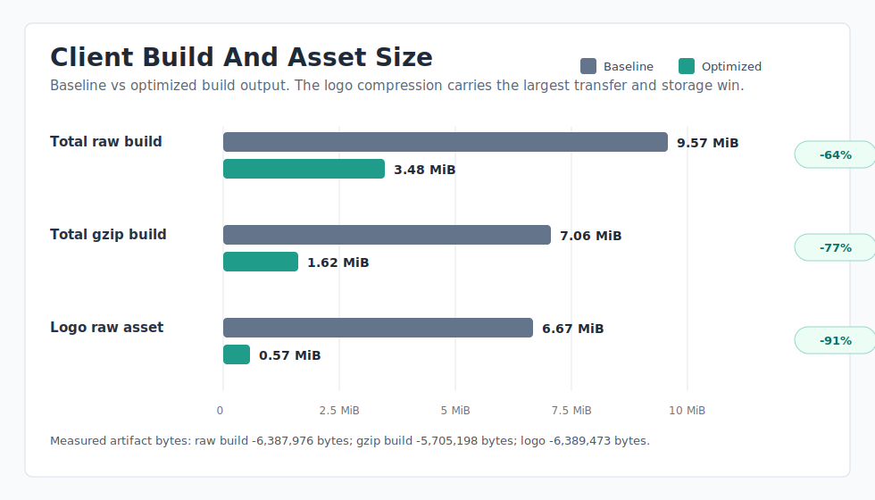
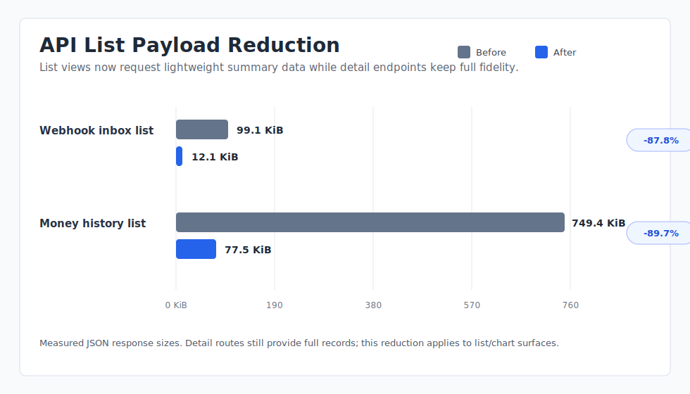
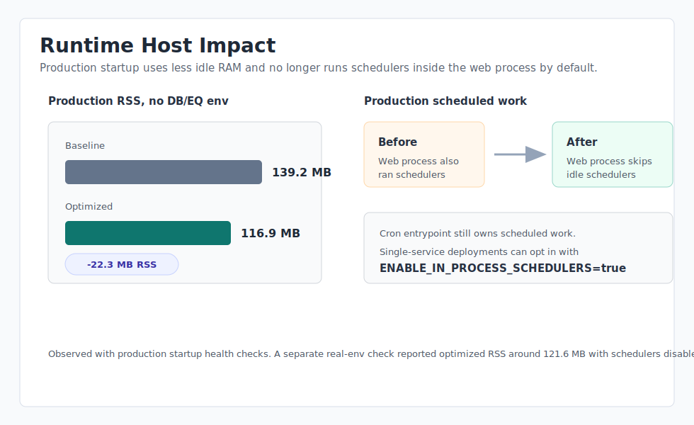
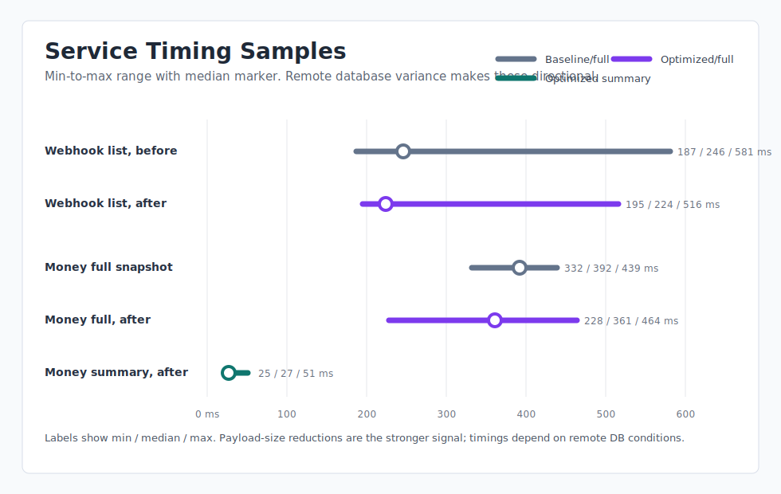
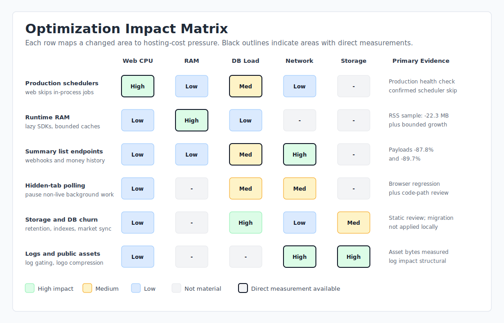

# Optimization Branch Performance Visuals

Branch: `codex/optimization`  
Baseline: merge base `461922fa0de25c4fbd9d1b81094a93fecfe93ea4`  
Measured: April 23, 2026

These visuals summarize the measured and expected hosting-cost impact of the optimization branch. Numeric charts use data from the local regression and comparison pass. Timing samples include remote database and network variance, so treat them as directional rather than lab-grade benchmark results.

## Executive Readout

## Area Assessment

| Changed area | Evidence type | Result | Hosting-cost assessment |
| --- | --- | --- | --- |
| Public logo asset and client build output | Measured bytes | Client build output fell by about 6.09 MiB raw and 5.44 MiB gzip. Logo raw size fell from about 6.67 MiB to 0.57 MiB. | High confidence reduction in static asset storage, deploy artifact size, transfer size, and first-load bandwidth. |
| Webhook inbox summary list | Measured payload | Page 1 payload fell from 101,520 bytes to 12,422 bytes, about 87.8% smaller. | High confidence reduction in API transfer, client parsing work, and server serialization memory for list views. |
| Money history summary list | Measured payload | 133-row list/chart payload fell from 767,430 bytes to 79,319 bytes, about 89.7% smaller. | High confidence reduction in API transfer and client memory for the money tracker history surface. |
| Production web-process schedulers | Runtime check | Production startup confirmed web service skips in-process money and market schedulers when `ENABLE_IN_PROCESS_SCHEDULERS=false`. | High confidence reduction in idle web CPU and remote DB work for multi-service deployments where cron owns scheduled work. |
| Runtime RAM: lazy SDK loading and bounded caches | Measured RSS plus structural review | No-DB production RSS fell from about 139.2 MB to 116.9 MB, about 22.3 MB lower. | High confidence lower idle RAM; cache bounds also limit long-lived memory growth. |
| Hidden-tab polling pause | Browser regression plus code path review | Non-live polling pauses while `document.hidden` and refreshes on visibility. | Medium confidence reduction in API traffic and DB work from idle browser tabs. Live loot monitoring remains active by design. |
| Storage and DB churn | Static/runtime review | Existing webhook retention settings are enforced, market listing sync churn is reduced, and hot-path indexes were added only where confirmed. | Medium to high confidence reduction in unnecessary row churn and improved query planning after migrations are applied. Migrations were not run against the shared remote DB locally. |
| Production log gating | Static/runtime review | Noisy production logging is gated. | Low to medium direct cost impact; improves log volume and observability signal. |

## Raw Measurements

| Metric | Baseline | Optimized | Delta |
| --- | ---: | ---: | ---: |
| Client build raw bytes | 10,034,653 | 3,646,677 | -6,387,976 |
| Client build gzip bytes | 7,402,110 | 1,696,912 | -5,705,198 |
| Logo raw bytes | 6,992,183 | 602,710 | -6,389,473 |
| Webhook list payload bytes | 101,520 | 12,422 | -89,098 |
| Money history payload bytes | 767,430 | 79,319 | -688,111 |
| Production RSS, no DB/EQ env | 139.2 MB | 116.9 MB | -22.3 MB |

## Testing Boundaries

Browser Use verified core read-only routes and controls against `http://localhost:5173`. Write or destructive actions were intentionally avoided against the shared Railway-backed database, including snapshot creation, auto-linking, webhook archive/delete/read-detail mutation, new raid creation, and save flows.

`npm run lint` remains blocked by existing server lint debt, mostly TypeScript import resolver issues and pre-existing explicit-any/unused/import-order findings. Server build, client type-check, root build, health checks, Browser Use regression, and production startup checks passed.
